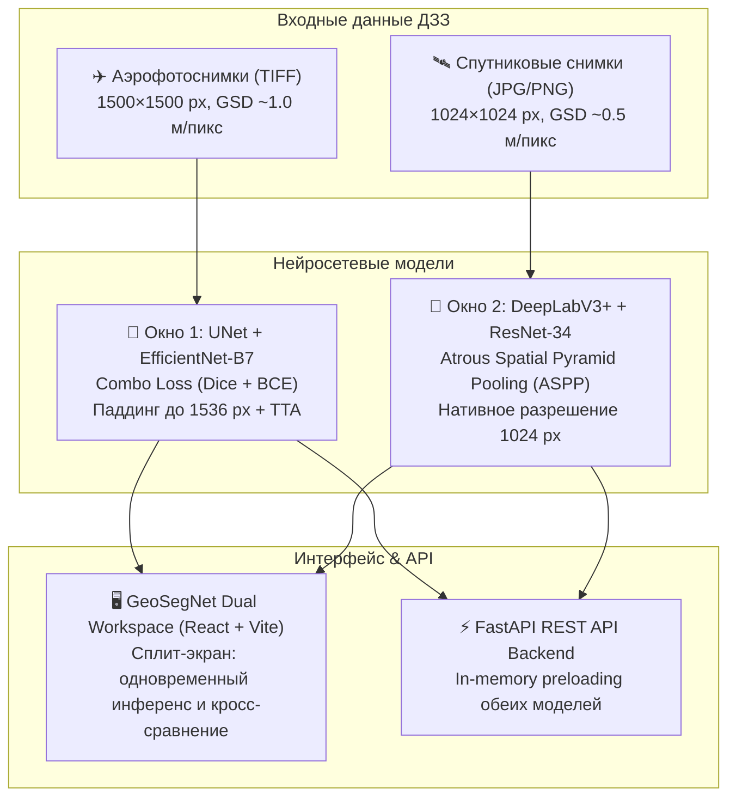

# 🛰️ GeoSegNet Dual: Сегментация дорог и зданий по аэро- и спутниковым снимкам

<p align="left">
  <a href="reports/Отчет_по_проекту_Итоговый.docx"></a>
  <a href="reports/Отчет_по_проекту.md"></a>
  <a href="https://www.kaggle.com/datasets/balraj98/massachusetts-roads-dataset"></a>
  <a href="https://www.kaggle.com/datasets/balraj98/deepglobe-road-extraction-dataset"></a>
  
  
  
  
</p>

Двухмодельная интеллектуальная система для автоматического выделения **дорожной сети** и **застройки** по материалам дистанционного зондирования Земли (ДЗЗ). Система одновременно поддерживает работу с детальными **аэрофотопланами** (БПЛА/авиация) и **спутниковыми снимками** оптико-электронных космических систем (DeepGlobe / Sentinel / WorldView).

---

## 🔀 Двухмодельная архитектура (Dual System)

Система разделяет обработку на два независимых специализированных пайплайна:



| Параметр | ✈️ Аэрофотоснимки (Окно 1) | 🛰️ Спутниковые снимки (Окно 2) |
| :--- | :--- | :--- |
| **Эталонный датасет** | Massachusetts Roads & Buildings | DeepGlobe Road Extraction Dataset |
| **Базовая архитектура** | **UNet** | **DeepLabV3+** |
| **Энкодер-бэкбон** | `efficientnet-b7` (ImageNet) | `resnet34` (ImageNet) |
| **Особенность декодера** | Skip-connections высокого разрешения | **ASPP** (контекст при разных dilation rates) |
| **Разрешение входа** | 1500×1500 px (паддинг до 1536 px) | 1024×1024 px (нативное без сжатия) |
| **Цвет индикации** | Циановый неоновый `#06b6d4` | Янтарный солнечный `#f59e0b` |
| **Поддерживаемые форматы** | `.tif`, `.tiff`, `.png`, `.jpg` | `.jpg`, `.jpeg`, `.png`, `.tif` |

---

## 📈 Количественные метрики

### 1. Тестовые выборки Massachusetts (Аэрофотосъемка)
| Задача | Выборка | IoU | Dice (F1) | Precision | Recall | Pixel Acc |
| :--- | :---: | :---: | :---: | :---: | :---: | :---: |
| 🛣️ **Дороги (Roads)** | 49 снимков | **48.72%** | **65.28%** | 57.04% | 77.30% | 96.26% |
| 🏢 **Здания (Buildings)** | 10 снимков | **60.39%** | **75.24%** | 79.08% | 71.87% | 91.43% |

### 2. DeepGlobe Road Extraction (Спутниковые снимки)
Датасет содержит 6 226 валидированных пар высокого разрешения (5 293 train, 933 val, 1 101 test).  
Поддерживается расчет как строгого IoU, так и **Relaxed IoU** (с допустимым буфером 2, 3 и 5 пикселей по стандарту соревнований DeepGlobe).

---

## 🐳 Быстрый запуск в Docker

Оба сервиса (FastAPI бэкенд и React фронтенд через Nginx) полностью контейнеризированы:

```bash
# Клонирование репозитория
git clone https://github.com/Shoto373/Roads-and-Buildings-segment.git
cd Roads-and-Buildings-segment

# Сборка и запуск контейнеров в фоне
docker compose up -d --build
```

После старта доступны следующие адреса:
* 🌐 **Веб-приложение (Dual Workspace):** [http://localhost:3000](http://localhost:3000)
* ⚡ **FastAPI REST API:** [http://localhost:8000](http://localhost:8000)
* 📚 **Интерактивная документация Swagger:** [http://localhost:8000/docs](http://localhost:8000/docs)
* 🩺 **Healthcheck статус моделей:** [http://localhost:8000/api/health](http://localhost:8000/api/health)

Остановка контейнеров:
```bash
docker compose down
```

---

## 💻 Локальная установка и запуск

### 1. Создание виртуального окружения
```bash
python -m venv .venv
.\.venv\Scripts\Activate.ps1    # Для Linux/macOS: source .venv/bin/activate
pip install -r requirements.txt
```

### 2. Загрузка спутникового датасета DeepGlobe
```bash
# Скачивание и автоматическая распаковка датасета DeepGlobe с Kaggle (~3.8 ГБ)
python download_deepglobe.py
```

### 3. Запуск веб-приложения локально (без Docker)
```bash
# Терминал 1: FastAPI бэкенд
python -m uvicorn backend.app.main:app --host 0.0.0.0 --port 8000 --reload

# Терминал 2: React фронтенд
cd frontend
npm install
npm run dev
```

---

## 🛠️ Консольные команды (CLI)

### Инференс
| Действие | Команда |
| :--- | :--- |
| **Аэрофотоснимки (до 10 примеров)** | `python inference.py --task road --num-examples 10` |
| **Инференс аэрофото с TTA** | `python inference.py --task road --tta --num-examples 10` |
| **Свой аэрофотоснимок (TIFF/PNG)** | `python inference.py --task road --input-image path/to/aerial.tif` |
| **Спутниковый снимок (DeepGlobe)** | `python inference.py --task deepglobe --weights weights/best_deepglobe_model.pth --input-image path/to/sat.jpg` |
| **Сегментация зданий** | `python inference.py --task building --num-examples 2` |

### Обучение
| Режим | Команда |
| :--- | :--- |
| **Обучение аэро-модели (UNet)** | `python train.py --task road --epochs 30 --batch-size 4` |
| **Обучение спутниковой модели (DeepLabV3+)** | `python train.py --task deepglobe --epochs 30 --batch-size 4` |
| **Пробная эпоха (Smoke-test / trial)** | `python train.py --task deepglobe --epochs 1 --batch-size 4 --limit 8` |

### Оценка качества и тесты
| Команда | Описание |
| :--- | :--- |
| `python evaluate.py --task road` | Расчет метрик тестового набора Massachusetts |
| `python evaluate.py --task deepglobe --slacks 2 3 5` | Оценка с расчетом strict & relaxed IoU (2, 3, 5 px) |
| `python check_satellite_model.py` | Диагностический чек-лист из 4 шагов для спутниковой модели |
| `pytest -v` | Запуск интеграционного набора тестов API и пайплайнов |

---

## 🖥️ Возможности интерфейса Dual Workspace

* **Два независимых окна загрузки:**
  * **Левое окно (✈️ Аэро):** настроено на прием снимков 1500×1500 (TIFF/PNG), использует модель `EffUNet-B7`, циановую маску.
  * **Правое окно (🛰️ Спутник):** принимает изображения 1024×1024 (JPG/PNG), использует `DeepLabV3+`, янтарную маску.
* **Быстрое управление:**
  * Кнопка **«Запустить оба окна»** — одновременный инференс двух потоков.
  * Кнопка **«Загрузить демо-пару»** — моментальная загрузка эталонных снимков (аэрофото развязки + спутниковый снимок).
  * Кнопка **«Снимок 1 → 2»** — перенос одного и того же снимка для сравнения поведения обеих нейросетей на одном объекте.
* **Интерактивный просмотр:**
  * Режимы отображения: наложение (Overlay), чистая маска (Mask), бок-о-бок (Side-by-Side).
  * Плавная регулировка прозрачности маски (0–100%).
  * Переключатель аугментации во время теста (TTA).
  * Выгрузка результатов в PNG и JSON-метрик покрытия.
  * Клик по логотипу **GeoSegNet Dual** мгновенно возвращает на главный экран.

---

## 📂 Структура проекта

```text
├── config.py                     # Единая конфигурация и аргументы CLI
├── train.py                      # Пайплайн обучения (Combo Loss, AMP, Early Stopping)
├── inference.py                  # Модуль инференса (TTA, arbitrary sizes, padding)
├── evaluate.py                   # Расчет метрик (IoU, Dice, Relaxed IoU)
├── deepglobe_dataset.py          # Загрузчик и сплиттер датасета DeepGlobe (1024×1024)
├── download_deepglobe.py         # Автоматическая загрузка датасета с Kaggle
├── check_satellite_model.py      # Скрипт верификации спутниковой модели
├── Dockerfile.backend            # Docker-образ FastAPI бэкенда (PyTorch CPU/CUDA)
├── Dockerfile.frontend           # Multi-stage Docker-образ React + Nginx
├── docker-compose.yml            # Оркестрация контейнеров бэкенда и фронтенда
├── backend/                      # FastAPI бэкенд
│   ├── app/
│   │   ├── api/endpoints.py      # Эндпоинты: /segment, /metrics, /samples, /health
│   │   ├── services/
│   │   │   ├── model_manager.py  # In-memory кэш обеих моделей
│   │   │   └── segmentation_service.py # Оверлеи, метрики площадей, маски
│   │   └── config.py             # Настройки путей и весов
│   └── static/samples/           # Демо-снимки (аэро и спутниковые)
├── frontend/                     # React + Vite + Tailwind CSS фронтенд
│   ├── src/
│   │   ├── components/
│   │   │   ├── DualWorkspace.tsx # Двухоконный сплит-интерфейс
│   │   │   ├── Header.tsx        # Верхняя панель со статусом и навигацией
│   │   │   ├── ImageDropzone.tsx # Drag & Drop зона с пресетами
│   │   │   ├── MetricsView.tsx   # Интерактивные графики метрик
│   │   │   └── GsdGuide.tsx      # Руководство по масштабам GSD
│   │   └── App.tsx               # Корневой компонент
│   └── nginx.conf                # Конфигурация Nginx с проксированием к API
├── outputs/                      # Визуализации, графики и маски
├── reports/                      # Итоговые аналитические отчеты (DOCX и MD)
└── weights/                      # Веса обученных моделей (.pth)
```

---

## 📄 Отчетные документы

* **Итоговый отчет:** [`reports/Отчет_по_проекту.md`](reports/Отчет_по_проекту.md) и [`reports/Отчет_по_проекту_Итоговый.docx`](reports/Отчет_по_проекту_Итоговый.docx)
* **Отчет об изменениях кодовой базы:** [`reports/Отчет_Изменения.md`](reports/Отчет_Изменения.md) и [`reports/Отчет_Изменения.docx`](reports/Отчет_Изменения.docx)
