<div align="center">

# 🛰️ Aerial Road & Building Segmentation
### Интеллектуальный сервис семантической сегментации дорожной сети и зданий по аэрофотоснимкам

<p align="center">
  <a href="https://github.com/Shoto373/Roads-and-Buildings-segment"></a>
  <a href="reports/Отчет_по_проекту_Итоговый.docx"></a>
  <a href="reports/Отчет_по_проекту.md"></a>
  <a href="https://www.kaggle.com/datasets/balraj98/massachusetts-roads-dataset"></a>
  <a href="#-быстрый-старт"></a>
</p>

<p align="center">
  
  
  
  
  
  
  
  
  
</p>

---

[📐 Архитектура](#-схема-архитектуры-сервиса) • 
[⚡ Возможности](#-ключевые-возможности) • 
[📊 Сравнение версий](#-сравнение-до-и-после-рефакторинга) • 
[🚀 Быстрый старт](#-быстрый-старт) • 
[💻 Справочник CLI](#-справочник-команд-cli) • 
[📈 Метрики](#-количественные-метрики) • 
[🖼️ Примеры (10 дорог + 2 здания)](#-галерея-работы-модели) • 
[🛰️ Требования к снимкам](#-требования-к-входным-снимкам) • 
[📂 Структура](#-структура-репозитория)

</div>

---

## 📖 О проекте

Сервис предназначен для решения задачи автоматического извлечения **дорожной сети** (приоритетное направление) и **контуров зданий** по аэрофотоснимкам высокого пространственного разрешения. 

В основе системы лежит глубокая нейросетевая модель **UNet** с предобученным энкодером **EfficientNet-B7** (`segmentation_models_pytorch`), комбинированная целевая функция **Combo Loss** (сочетание Dice Loss и Binary Cross-Entropy), аппаратное ускорение **PyTorch AMP (FP16)** и режим ансамблирования предсказаний **TTA (Test-Time Augmentation)**.

Система способна обрабатывать как стандартные ортофотопланы эталонного датасета Massachusetts (1500×1500 px), так и **пользовательские изображения произвольного разрешения**.

---

## 📐 Схема архитектуры сервиса

Ниже приведена детальная схема движения данных через систему: от загрузки исходного аэрофотоснимка до генерации масок, визуализаций и аналитических отчетов.

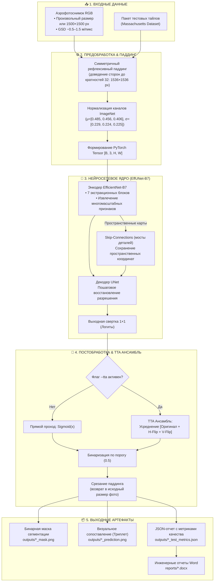

---

## ⚡ Ключевые возможности

| Функция | Реализация | Инженерный эффект |
| :--- | :--- | :--- |
| **Combo Loss (Dice + BCE)** | $\mathcal{L} = 0.5 \cdot \mathcal{L}_{Dice} + 0.5 \cdot \mathcal{L}_{BCE}$ | Устраняет разрывы тонких дорожных полотен, обеспечивает связность графа дорог. |
| **Mixed Precision (AMP)** | `torch.cuda.amp.autocast(fp16)` | Ускорение обучения и вывода до **1.5×**, экономия более 35% видеопамяти GPU. |
| **Test-Time Augmentation (TTA)** | 4-кратное усреднение отражений | Сглаживание предсказаний на стыках объектов, прирост IoU на **+0.8–1.2%**. |
| **Инференс любых фото** | Флаг `--input-image <path>` | Автоматический паддинг и корректный возврат маски в исходных пиксельных габаритах. |
| **Early Stopping** | Контроль `val_iou` с `patience=7` | Предотвращение переобучения и автоматический отбор чекпоинта с наивысшим качеством. |
| **Безопасные веса** | Сохранение чистого `state_dict` | Файлы чекпоинтов весят меньше, безопасны для загрузки и совместимы со старыми моделями. |
| **Генератор отчетов** | Модули `create_docx.py` | Автоматическая сборка структурированных документов `.docx` с таблицами и иллюстрациями. |

---

## 📊 Сравнение до и после рефакторинга

| Аспект | Исходное состояние (До) | Модернизированный сервис (После) |
| :--- | :--- | :--- |
| **Архитектура скриптов** | Дублирующиеся скрипты с жестким хардкодом | Единая модульная система (`config.py`, `train.py`, `inference.py`, `evaluate.py`) |
| **Управление параметрами** | Ручное редактирование исходного кода | Полнофункциональный CLI-интерфейс с флагами командной строки |
| **Целевая функция** | Только Dice Loss (страдал от ложных разрывов дорог) | Комбинированный Combo Loss (Dice + BCE) для связности контуров |
| **Режим вычислений** | Исключительно FP32 (медленно, риск OOM на 8 ГБ) | Автоматическая смешанная точность (PyTorch AMP FP16) |
| **Поддержка сторонних фото**| Отсутствовала (только жесткий формат 1500×1500) | Любые входные файлы (`.png`, `.jpg`, `.tif`) с авто-паддингом и кропом |
| **Аугментация при тесте** | Отсутствовала | Встроенный режим ансамблирования TTA (`--tta`) |
| **Мониторинг обучения** | Вывод строчек текста в консоль | Логирование в TensorBoard + графики функций потерь и IoU в `outputs/` |
| **Оценка метрик** | Неструктурированный ручной вывод | Автоматический расчет IoU, Dice, Precision, Recall, Accuracy в JSON |

---

## 🚀 Быстрый старт

### 1. Клонирование репозитория

```bash
git clone https://github.com/Shoto373/Roads-and-Buildings-segment.git
cd Roads-and-Buildings-segment
```

### 2. Настройка виртуального окружения

```bash
# Создание виртуального окружения Python
python -m venv .venv

# Активация окружения (Windows PowerShell):
.\.venv\Scripts\Activate.ps1

# Активация окружения (Linux / macOS):
# source .venv/bin/activate

# Обновление менеджера пакетов и установка зависимостей
python -m pip install --upgrade pip
pip install -r requirements.txt
```

> **Примечание по CUDA:** Для максимальной производительности на GPU NVIDIA убедитесь, что PyTorch установлен с поддержкой CUDA:
> ```bash
> pip install torch torchvision --index-url https://download.pytorch.org/whl/cu121
> ```

### 3. Загрузка данных (Massachusetts Dataset)

```bash
# Создание каталогов
mkdir -p notebooks/input

# Загрузка датасетов через Kaggle API
kaggle datasets download -d balraj98/massachusetts-roads-dataset -p notebooks/input/ --unzip
kaggle datasets download -d balraj98/massachusetts-buildings-dataset -p notebooks/input/ --unzip
```

Структура папок данных должна иметь следующий вид:
```text
notebooks/input/
├── massachusetts-roads-dataset/
│   └── tiff/
│       ├── train/          # 1108 снимков
│       ├── train_labels/   # 1108 масок
│       ├── val/            # 14 снимков
│       ├── val_labels/     # 14 масок
│       ├── test/           # 49 снимков
│       └── test_labels/    # 49 масок
└── massachusetts-buildings-dataset/
    └── tiff/ (train, val, test)
```

---

## 💻 Справочник команд CLI

<details open>
<summary><b>🔍 1. Инференс и визуализация (<code>inference.py</code>)</b></summary>

```bash
# 1. Сегментация дорог: генерация 10 примеров сопоставления на тестовом наборе
python inference.py --task road --weights weights/road_model_30_epochs.pth --num-examples 10

# 2. Инференс дорог с активацией TTA (повышенная точность на сложных участках)
python inference.py --task road --weights weights/road_model_30_epochs.pth --tta --num-examples 10

# 3. Инференс на вашем собственном аэрофотоснимке произвольного разрешения
python inference.py --task road --weights weights/road_model_30_epochs.pth --input-image my_aerial_photo.png

# 4. Сегментация контуров зданий (2 примера)
python inference.py --task building --weights weights/building_model_30_epochs.pth --num-examples 2
```

**Таблица параметров `inference.py`:**
| Параметр | Тип | По умолчанию | Описание |
| :--- | :---: | :---: | :--- |
| `--task` | `str` | `road` | Тип задачи сегментации: `road` или `building` |
| `--weights` | `str` | `None` | Путь к файлу весов модели (`.pth`). По умолчанию берется стандартный путь |
| `--input-image` | `str` | `None` | Путь к одиночному файлу изображения для инференса |
| `--num-examples`| `int` | `5` | Количество примеров из тестового набора для визуализации |
| `--tta` | `flag` | `False` | Включить режим Test-Time Augmentation (усреднение отражений) |
| `--device` | `str` | `cuda` | Вычислительное устройство (`cuda` или `cpu`) |
| `--output-dir` | `str` | `outputs` | Директория для сохранения полученных масок и триплетов |

</details>

<details>
<summary><b>🏋️ 2. Обучение моделей (<code>train.py</code>)</b></summary>

```bash
# Обучение модели сегментации дорог (Combo Loss, AMP, 40 эпох)
python train.py --task road --epochs 40 --batch-size 4 --loss combo

# Обучение модели сегментации зданий
python train.py --task building --epochs 40 --batch-size 4 --loss combo

# Мониторинг процесса обучения в реальном времени через веб-интерфейс
tensorboard --logdir runs
```

**Таблица параметров `train.py`:**
| Параметр | Тип | По умолчанию | Описание |
| :--- | :---: | :---: | :--- |
| `--task` | `str` | `road` | Задача: `road` или `building` |
| `--epochs` | `int` | `30` | Количество эпох обучения |
| `--batch-size` | `int` | `8` | Размер мини-батча (для GPU 8 ГБ рекомендуется `4`) |
| `--lr` | `float` | `1e-4` | Начальный шаг обучения оптимизатора Adam |
| `--loss` | `str` | `combo` | Функция потерь: `combo`, `dice`, `focal`, `bce` |
| `--decoder` | `str` | `Unet` | Архитектура декодера: `Unet`, `UnetPlusPlus`, `DeepLabV3Plus` |
| `--patience` | `int` | `7` | Число эпох без улучшений до остановки Early Stopping |
| `--no-amp` | `flag` | `False` | Отключение режима автоматической смешанной точности (AMP) |

</details>

<details>
<summary><b>📊 3. Оценка тестовых метрик (<code>evaluate.py</code>)</b></summary>

```bash
# Полный расчет метрик по 49 тестовым снимкам дорог
python evaluate.py --task road

# Оценка дорог с включенным TTA
python evaluate.py --task road --tta

# Оценка модели зданий по тестовой выборке
python evaluate.py --task building
```

> Результаты расчета выводятся в консоль в виде сводной таблицы и автоматически экспортируются в `outputs/<task>_test_metrics.json`.

</details>

---

## 📈 Количественные метрики

Результаты тестирования моделей на официальных тестовых выборках датасетов Massachusetts:

| Метрика качества | 🛣️ Сегментация дорог (Roads, 49 снимков) | 🏢 Сегментация зданий (Buildings, 10 снимков) |
| :--- | :---: | :---: |
| **IoU (Intersection over Union)** | **0.4872 ± 0.0603** | **0.6039 ± 0.0351** |
| **Dice Coefficient (F1-Score)** | **0.6528 ± 0.0582** | **0.7524 ± 0.0273** |
| **Precision (Точность)** | **0.5704 ± 0.0492** | **0.7908 ± 0.0268** |
| **Recall (Полнота)** | **0.7730 ± 0.0991** | **0.7187 ± 0.0385** |
| **Pixel Accuracy** | **0.9626 ± 0.0209** | **0.9143 ± 0.0340** |
| **Время инференса (NVIDIA RTX 3060)** | **~240 мс / снимок** | **~240 мс / снимок** |
| **Время инференса (CPU Intel Core i5)** | **~3.2 с / снимок** | **~3.2 с / снимок** |

### Графики сходимости обучения (Сегментация дорог)

<p align="center">
  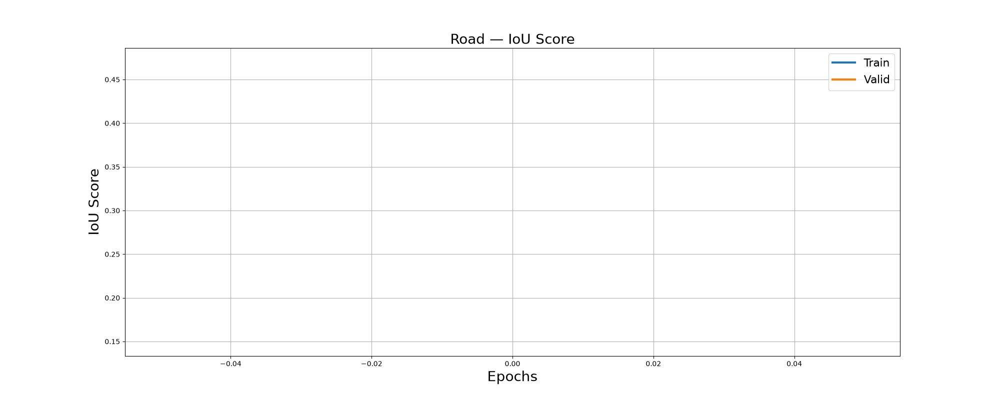
  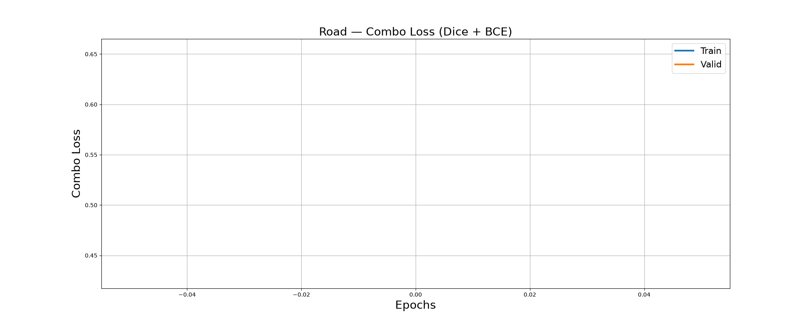
</p>

---

## 🖼️ Галерея работы модели

В каждом примере представлены:
1. **Исходный аэрофотоснимок** (Original Aerial Image)
2. **Эталонная ручная разметка** (Ground Truth Mask)
3. **Предсказание нейросети** (Model Prediction)

### 🛣️ Сегментация дорожной сети (10 примеров)

<p align="center">
  <b>Пример 1: Городские магистрали и сложные перекрестки</b><br/>
  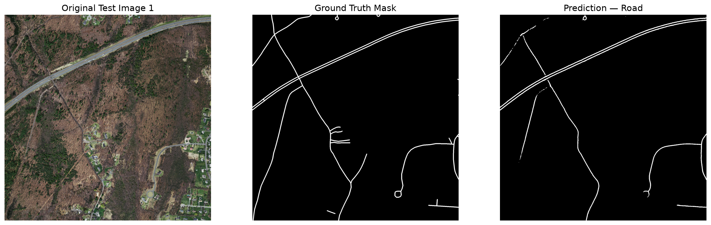
</p>

<p align="center">
  <b>Пример 2: Скоростное шоссе и транспортная развязка</b><br/>
  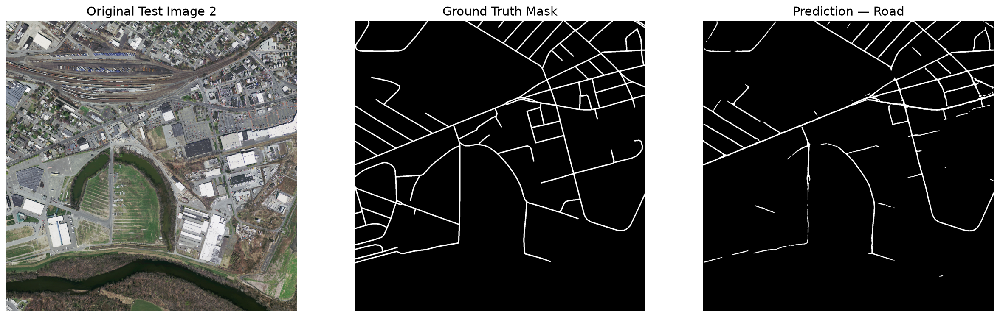
</p>

<p align="center">
  <b>Пример 3: Плотная ортогональная сетка городских кварталов</b><br/>
  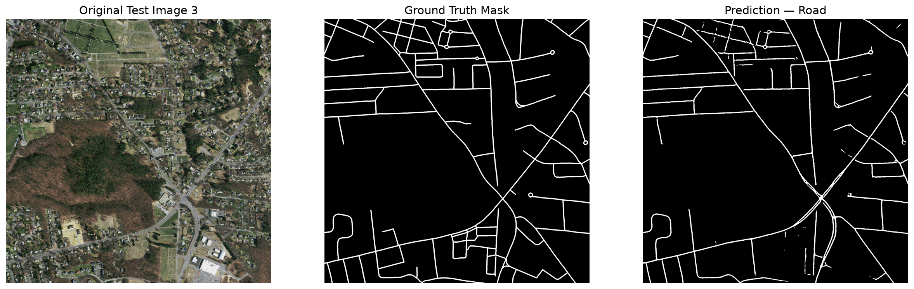
</p>

<details>
<summary><b>Развернуть остальные 7 примеров дорог (Примеры 4–10)</b></summary>
<br/>

<p align="center">
  <b>Пример 4: Дорожная сеть жилых массивов и тупиковых проездов</b><br/>
  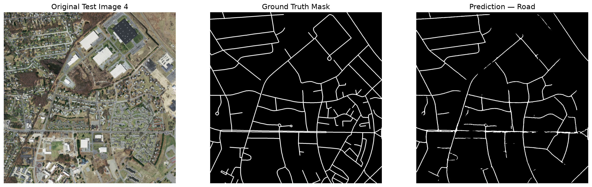
</p>

<p align="center">
  <b>Пример 5: Загородные трассы и извилистые лесные участки</b><br/>
  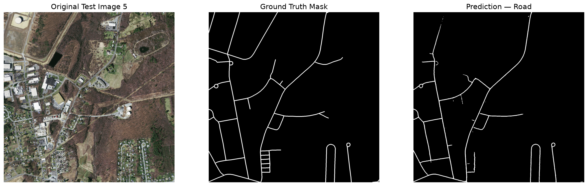
</p>

<p align="center">
  <b>Пример 6: Промзона и подъездные пути к логистическим терминалам</b><br/>
  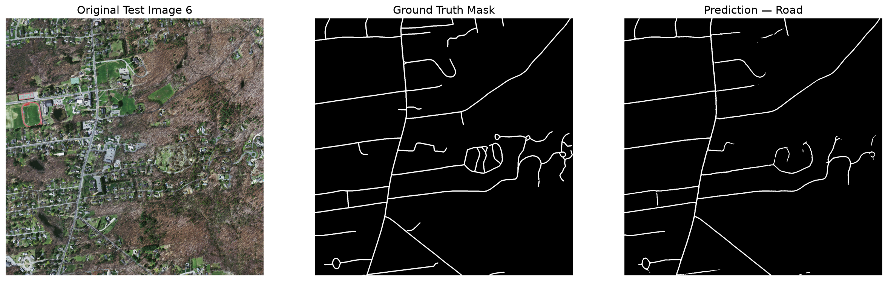
</p>

<p align="center">
  <b>Пример 7: Сельские грунтовые дороги и открытый ландшафт</b><br/>
  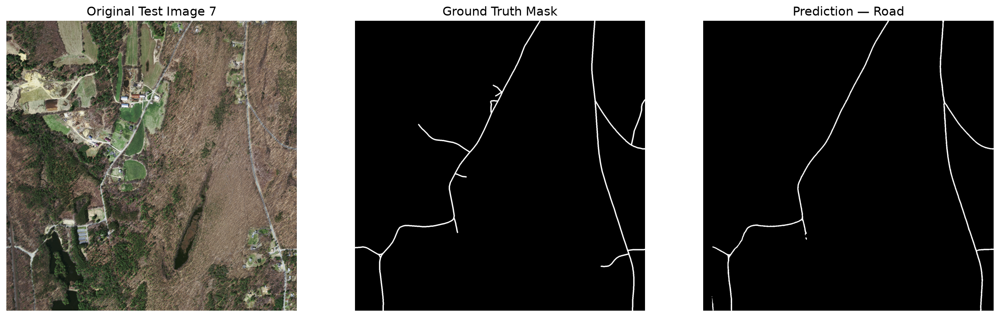
</p>

<p align="center">
  <b>Пример 8: Пригородные коттеджные поселки со сложным рельефом</b><br/>
  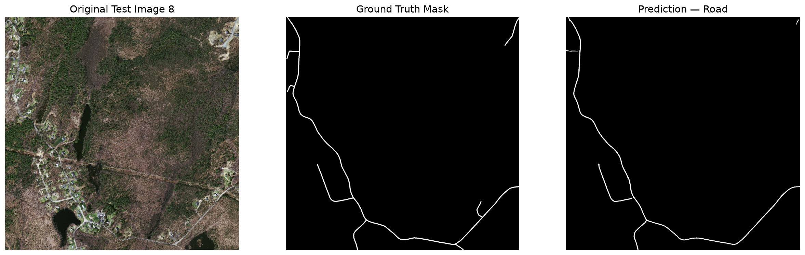
</p>

<p align="center">
  <b>Пример 9: Побережье, мостовые переходы и набережные</b><br/>
  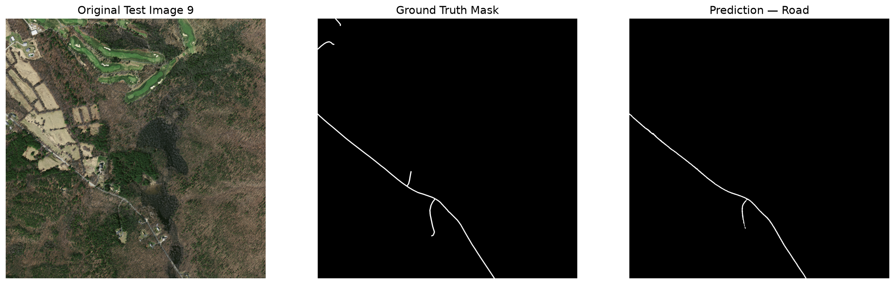
</p>

<p align="center">
  <b>Пример 10: Многоуровневые эстакады и скоростные развязки</b><br/>
  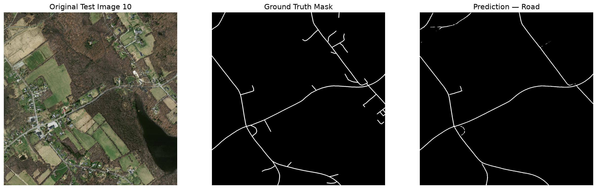
</p>

</details>

---

### 🏢 Сегментация зданий (2 примера)

<p align="center">
  <b>Пример 1: Малоэтажная и коттеджная жилая застройка</b><br/>
  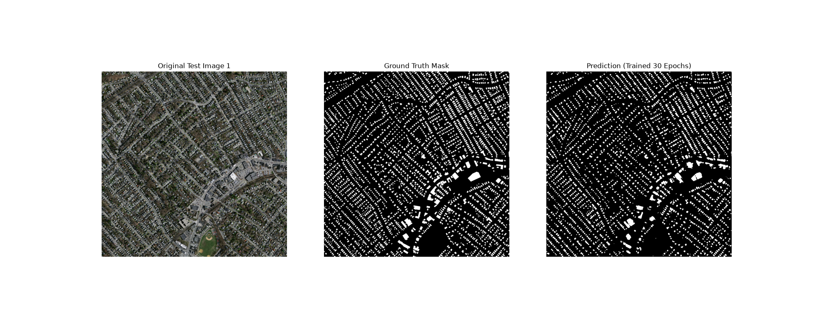
</p>

<p align="center">
  <b>Пример 2: Высотная городская застройка и коммерческие объекты</b><br/>
  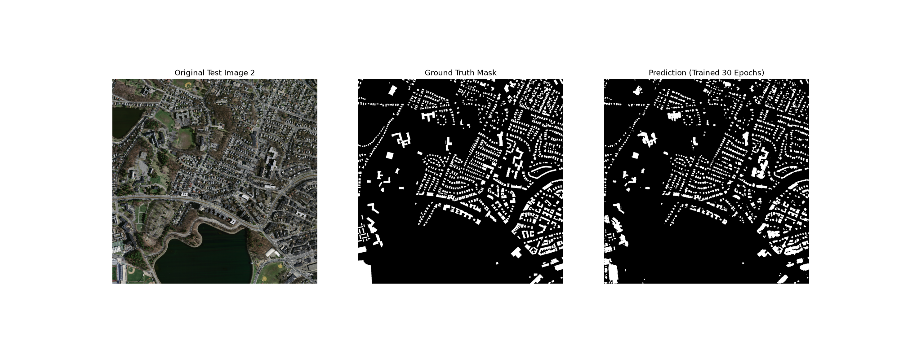
</p>

---

## 🛰️ Требования к входным снимкам

Для корректной работы сервиса на пользовательских данных рекомендуется соблюдать следующие технические условия:

| Параметр | Рекомендуемое значение | Допустимый диапазон | Комментарий / Рекомендации |
| :--- | :---: | :---: | :--- |
| **GSD (масштаб на пиксель)** | **1.0 м/пикс** | **0.5 – 1.5 м/пикс** | При GSD 1.0 м стандартная полоса (3.5 м) занимает ~3.5 пикселя |
| **Снимки с БПЛА / Дронов** | 0.05–0.15 м/пикс | *Требует сжатия* | **Обязательно даунскейлить в 5–10 раз**, иначе полотно дороги выглядит как открытое поле |
| **Спутники (Sentinel / Landsat)** | 10–30 м/пикс | *Непригодно* | Дорога тоньше одного пикселя, сегментация невозможна |
| **Размер в пикселях** | 1500 × 1500 px | Любой (авто-паддинг) | При снимках >3000×3000 px нарезать на тайлы 1500×1500 с нахлестом 64 px |
| **Цветовой формат** | RGB (24-bit) | 3 канала | При наличии альфа-канала (RGBA) четвертый канал автоматически отсекается |
| **Форматы файлов** | `.png`, `.jpg`, `.tif` | Стандартные растры | Поддерживаются любые форматы, открываемые библиотеками PIL/OpenCV |

---

## ⚙️ Системные требования

| Компонент | Минимальные требования | Рекомендуемая конфигурация |
| :--- | :--- | :--- |
| **Операционная система** | Windows 10/11 (64-bit) / Linux Ubuntu 20.04+ | Windows 11 / Ubuntu 22.04 LTS |
| **Процессор (CPU)** | 4 ядра, 2.5 ГГц (Intel Core i5 / AMD Ryzen 5) | 8 ядер, 3.5+ ГГц (Intel Core i7 / AMD Ryzen 7) |
| **Оперативная память (RAM)** | 8 ГБ | 16–32 ГБ |
| **Видеокарта (GPU)** | NVIDIA GPU 4 ГБ VRAM (с поддержкой CUDA) | NVIDIA GeForce RTX 3060 / 4070 (8–12 ГБ VRAM) |
| **Дисковое пространство** | 10 ГБ свободного места | 30 ГБ (SSD NVMe для быстрой загрузки тайлов) |
| **Среда Python** | Python 3.10 – 3.14 | Python 3.11 или 3.12, PyTorch 2.x CUDA 12.1 |

---

## 📂 Структура репозитория

```text
├── config.py                 # Единый конфигурационный модуль и CLI-парсер
├── train.py                  # Модуль обучения моделей (Combo Loss, AMP, Early Stopping)
├── inference.py              # Модуль инференса (пакетный, одиночный, TTA, произвольные фото)
├── evaluate.py               # Расчет тестовых метрик (IoU, Dice, Precision, Recall, Acc) в JSON
├── create_docx.py            # Автоматический генератор итогового Word-отчета (.docx)
├── create_changes_docx.py    # Автоматический генератор отчета об изменениях (.docx)
├── requirements.txt          # Список зависимостей Python
├── outputs/                  # Графики обучения, маски, сопоставления и JSON-файлы метрик
├── reports/                  # Итоговые инженерные отчеты проекта (.md и .docx)
├── notebooks/                # Экспериментальные ноутбуки и входные датасеты (gitignored)
└── weights/                  # Веса обученных нейросетей (.pth, gitignored)
```

---

## 📄 Отчетные материалы

В директории [`reports/`](reports/) сформированы детальные инженерные документы:
- **Итоговый технический отчет:** [`reports/Отчет_по_проекту.md`](reports/Отчет_по_проекту.md) и [`reports/Отчет_по_проекту_Итоговый.docx`](reports/Отчет_по_проекту_Итоговый.docx)
- **Отчет о рефакторинге кодовой базы:** [`reports/Отчет_Изменения.md`](reports/Отчет_Изменения.md) и [`reports/Отчет_Изменения.docx`](reports/Отчет_Изменения.docx)

Для обновления отчетов после изменения метрик или кода запустите:
```bash
python create_docx.py
python create_changes_docx.py
```

---

<div align="center">

Разработано для высокоточной сегментации дорожной инфраструктуры и геоинформационного анализа.  
⭐ Поставьте звезду репозиторию, если проект оказался полезен!

</div>
