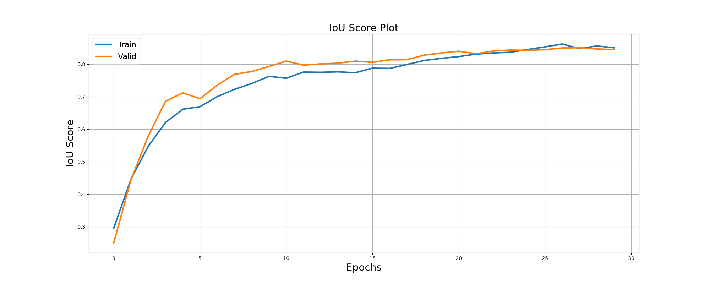
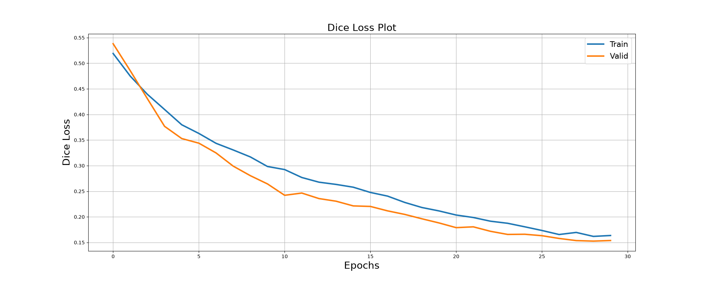
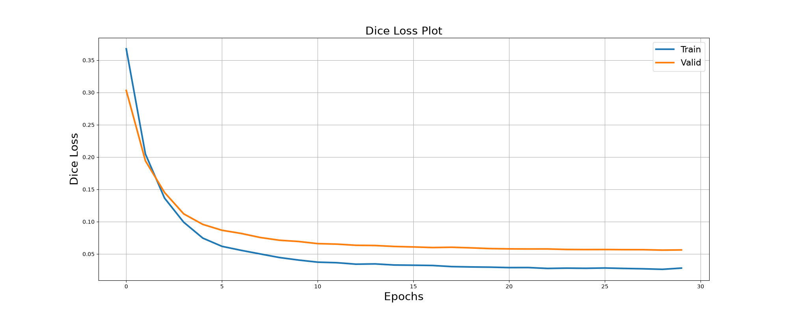
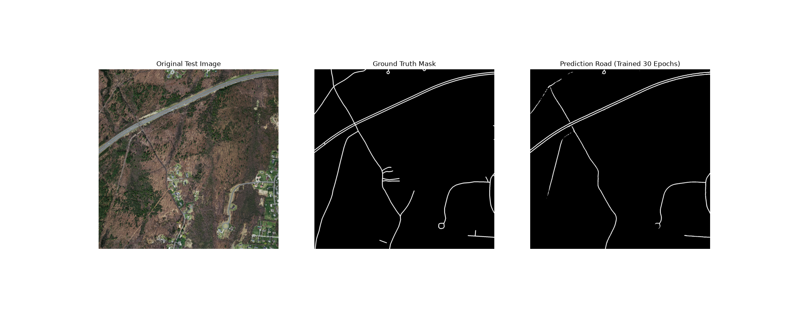

# Building and Road Segmentation from Aerial Images using EffUNet

In city, information about urban objects such as water supply, railway lines, power lines, buildings, roads, etc., is necessary for city planning. In particular, information about the spread of these objects, locations and capacity is needed for the policymakers to make impactful decisions. This thesis aims to segment the building and roads from the aerial image captured by the satellites and UAVs. Many different architectures have been proposed for the semantic segmentation task and UNet being one of them. In this thesis, we propose a novel architecture based on Google's newly proposed EfficientNetV2 as an encoder for feature extraction with UNet decoder for constructing the segmentation map. Using this approach we achieved a benchmark score for the Massachusetts Building and Road dataset with an mIOU of 0.8365 and 0.9153 respectively.


## Tech Stack

**Libraries:** PyTorch, Numpy, Matplotlib, SMP, TensorBoard

## Project Structure

```
├── config.py                # Centralized configuration & CLI parser
├── train.py                 # Unified training script (road & building)
├── inference.py             # Unified inference (custom images, batch, TTA)
├── evaluate.py              # Full test-set evaluation with metrics
├── create_docx.py           # Project report generation (.docx)
├── create_changes_docx.py   # Codebase changes report generation (.docx)
├── requirements.txt
├── notebooks/
│   ├── building/            # Jupyter experiments (V2S, V2M, V2L, B7, MiTB5)
│   ├── road/                # Jupyter experiments (V2S, V2M, V2L, B7)
│   └── input/               # Datasets (gitignored)
├── weights/                 # Model checkpoints (gitignored)
├── outputs/                 # Plots, demo images, metrics JSON
└── reports/                 # Project reports (.md and .docx)
```

## Key Features

- **Combo Loss** (Dice + BCE) — improved segmentation of thin structures (roads)
- **Mixed Precision (AMP)** — ~1.5x faster training on GPU
- **Early Stopping** — prevents overfitting with configurable patience
- **TensorBoard** — live training metrics visualization
- **Test-Time Augmentation (TTA)** — improved inference with multi-view averaging
- **Rich Augmentations** — ColorJitter, GaussNoise, Blur, CLAHE, BrightnessContrast
- **Multiple Decoders** — UNet, UNet++, DeepLabV3+ via CLI flag
- **Unified CLI** — one script per task, configurable via `--task road/building`

## Quick Start

### Installation
```bash
git clone https://github.com/Shoto373/Roads-and-Buildings-segment.git
cd Roads-and-Buildings-segment
python -m venv .venv
.\.venv\Scripts\activate       # Windows
# source .venv/bin/activate    # Linux/Mac
pip install -r requirements.txt
```

### Data Preparation
Download datasets via Kaggle API and extract to `notebooks/input/`:
```bash
kaggle datasets download -d balraj98/massachusetts-buildings-dataset
kaggle datasets download -d balraj98/massachusetts-roads-dataset
```

### Training
```bash
# Train road segmentation (default)
python train.py --task road

# Train building segmentation
python train.py --task building

# Custom configuration
python train.py --task road --epochs 50 --decoder UnetPlusPlus --batch-size 4

# Monitor training
tensorboard --logdir=runs
```

### Inference
```bash
# Single demo prediction
python inference.py --task road --idx 0

# Predict on custom input image
python inference.py --task road --input-image path/to/image.png

# Generate 10 examples
python inference.py --task road --num-examples 10

# With Test-Time Augmentation
python inference.py --task road --tta --num-examples 10
```

### Evaluation
```bash
# Full test-set evaluation
python evaluate.py --task road

# With TTA
python evaluate.py --task road --tta
```


## Results

### Evaluation of different models for building dataset

| Model | mIOU | Dice Loss | Precision | Recall | F1 Score | Accuracy |
| :---: | :---: |  :---: |  :---: |  :---: |  :---: |  :---: |  
|V2S+UNet|0.8159|0.1054|0.8746|0.9220|0.8977|0.8997|
|V2M+UNet|0.8293|0.0977|0.8821|0.9316|0.9062|0.9080|
|B7+UNet|0.8359|0.0934|0.8863|0.9352|0.9101|0.9119|
|V2L+UNet|0.8365|0.0925|0.8865|0.9356|0.9104|0.9122|

### Evaluation of different models for road dataset

| Model | mIOU | Dice Loss | Precision | Recall | F1 Score | Accuracy |
| :---: | :---: |  :---: |  :---: |  :---: |  :---: |  :---: |  
|V2S+UNet|0.9139|0.0453|0.9321|0.9786|0.9548|0.9558|
|V2M+UNet|0.9140|0.0475|0.9323|0.9786|0.9549|0.9559|
|V2L+UNet|0.9147|0.0468|0.9328|0.9790|0.9553|0.9563|
|B7+UNet|0.9153|0.0461|0.9332|0.9792|0.9556|0.9566|

### Building Segmentation


### Road Segmentation


### 30 Epochs Training Results

**Training Progress (IoU Score and Dice Loss):**




**Prediction on Test Data:**


### 30 Epochs Training Results (Roads)

**Hardware:** CPU  
**Training time:** ~9 часов (с 16:50 до 01:46)

**Training Progress (IoU Score and Dice Loss):**




**Prediction on Test Data:**


