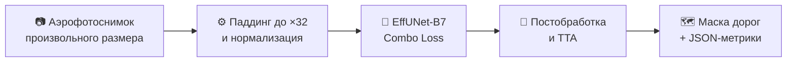

# 🛰️ Сегментация дорог и зданий по аэрофотоснимкам

<p align="left">
  <a href="reports/Отчет_по_проекту_Итоговый.docx"></a>
  <a href="reports/Отчет_по_проекту.md"></a>
  <a href="https://www.kaggle.com/datasets/balraj98/massachusetts-roads-dataset"></a>
  
  
  
</p>

Система автоматического выделения **дорожной сети** (основная задача) и **зданий** по аэрофотоснимкам на базе нейросети **EfficientNet-B7 + UNet**. Поддерживает инференс изображений любого разрешения, комбинированный лосс **Combo Loss (Dice + BCE)**, ускорение **AMP (FP16)** и режим **TTA**.

---

## 📐 Схема пайплайна



---

## 📈 Количественные метрики

Результаты на тестовых выборках датасета Massachusetts:

| Задача | Тестовая выборка | IoU | Dice (F1) | Precision | Recall | Pixel Acc |
| :--- | :---: | :---: | :---: | :---: | :---: | :---: |
| 🛣️ **Дороги (Roads)** | 49 снимков | **48.72%** | **65.28%** | 57.04% | 77.30% | 96.26% |
| 🏢 **Здания (Buildings)** | 10 снимков | **60.39%** | **75.24%** | 79.08% | 71.87% | 91.43% |

---

## 🚀 Быстрый старт

### 1. Установка окружения
```bash
git clone https://github.com/Shoto373/Roads-and-Buildings-segment.git
cd Roads-and-Buildings-segment

python -m venv .venv
.\.venv\Scripts\Activate.ps1    # Для Linux/macOS: source .venv/bin/activate
pip install -r requirements.txt
```

### 2. Запуск готовых команд

| Действие | Команда |
| :--- | :--- |
| **Сегментация дорог (10 примеров)** | `python inference.py --task road --num-examples 10` |
| **Инференс на вашем снимке** | `python inference.py --task road --input-image path/to/image.png` |
| **Инференс с TTA (максимальная точность)** | `python inference.py --task road --tta --num-examples 10` |
| **Сегментация зданий** | `python inference.py --task building --num-examples 2` |
| **Обучение модели дорог** | `python train.py --task road --epochs 30 --batch-size 4` |
| **Расчет метрик в JSON** | `python evaluate.py --task road` |

> Результаты инференса (бинарные маски и сопоставления) сохраняются в каталог `outputs/`.

---

## 🖼️ Примеры работы

### Сегментация дорожной сети
<p align="center">
  <b>Пример: Транспортная развязка и скоростное шоссе</b><br/>
  
</p>

<p align="center">
  <b>Пример: Городские улицы и перекрестки</b><br/>
  
</p>

<details>
<summary><b>Показать еще 8 примеров сегментации дорог</b></summary>
<br/>

<p align="center"></p>
<p align="center"></p>
<p align="center"></p>
<p align="center"></p>
<p align="center"></p>
<p align="center"></p>
<p align="center"></p>
<p align="center"></p>

</details>

### Сегментация зданий
<p align="center">
  <b>Пример: Малоэтажная и городская застройка</b><br/>
  
</p>

---

## 🛰️ Требования к снимкам

| Параметр | Требование | Пояснение |
| :--- | :--- | :--- |
| **Масштаб (GSD)** | **0.5 – 1.5 м/пикс** (эталон ~1.0 м) | При 1 м/пикс ширина стандартной дороги составляет 6–8 пикселей. |
| **Снимки с БПЛА / дронов** | Сжатие в 5–10 раз | Сверхвысокое разрешение (<0.1 м/пикс) необходимо даунскейлить. |
| **Разрешение в пикселях** | Любое | Скрипт автоматически дополняет изображение до кратности 32 и обрезает маску обратно. |
| **Формат файлов** | RGB (24-bit), `.png`, `.jpg`, `.tif` | Стандартные растровые изображения без необходимости геопривязки. |

---

## 📂 Структура проекта

```text
├── config.py                 # Конфигурация и единый CLI-парсер
├── train.py                  # Обучение (Combo Loss, AMP FP16, Early Stopping)
├── inference.py              # Инференс (пакетный, одиночный, TTA, произвольные фото)
├── evaluate.py               # Оценка метрик тестового набора в JSON
├── create_docx.py            # Генератор итогового Word-отчета
├── outputs/                  # Маски, визуализации и метрики
├── reports/                  # Итоговые отчеты (DOCX и Markdown)
└── weights/                  # Чекпоинты обученных моделей (.pth)
```

---

## 📄 Отчетные документы

* **Итоговый отчет:** [`reports/Отчет_по_проекту.md`](reports/Отчет_по_проекту.md) и [`reports/Отчет_по_проекту_Итоговый.docx`](reports/Отчет_по_проекту_Итоговый.docx)
* **Отчет об изменениях кодовой базы:** [`reports/Отчет_Изменения.md`](reports/Отчет_Изменения.md) и [`reports/Отчет_Изменения.docx`](reports/Отчет_Изменения.docx)
